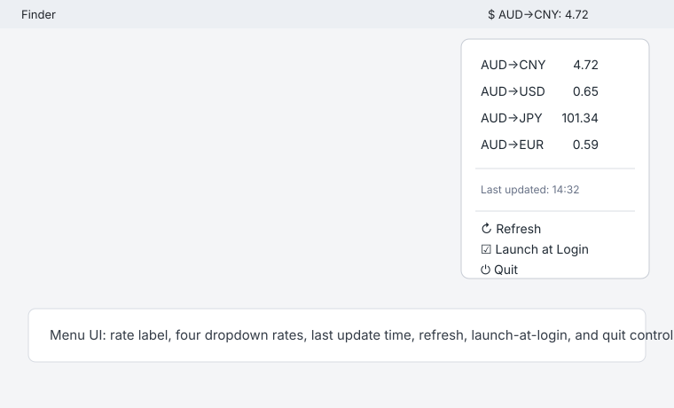

# RateBar

RateBar is a macOS menu bar exchange-rate utility. The MVP shows AUD to CNY in the menu bar and exposes AUD to CNY, USD, JPY, and EUR in the dropdown menu.

## Screenshot



## Requirements

- macOS 26 Tahoe or later
- Xcode 26 or later with Swift 6
- XcodeGen

Install XcodeGen with Homebrew:

```sh
brew install xcodegen
```

## Build

Generate the Xcode project, then build the app:

```sh
xcodegen generate
xcodebuild -scheme RateBar -destination "platform=macOS,arch=$(uname -m)" build
```

## Release Build

Create a local Release build of the `.app` bundle:

```sh
xcodebuild -scheme RateBar -destination "platform=macOS,arch=$(uname -m)" -configuration Release -derivedDataPath build build
```

The app bundle is produced at:

```sh
build/Build/Products/Release/RateBar.app
```

## Test

Run the XCTest suite:

```sh
xcodebuild -scheme RateBar -destination "platform=macOS,arch=$(uname -m)" test
```

## Run

Open the generated project and run the `RateBar` scheme from Xcode. The menu bar extra displays `AUD→CNY` as the compact title; opening it shows the four configured AUD exchange-rate pairs, the last successful refresh time, Refresh, Launch at Login, and Quit.

Use the Launch at Login toggle to register or unregister RateBar with macOS login items. A full launch-at-login verification requires running the app on the target Mac, enabling the toggle, and signing out or restarting to confirm the menu bar extra appears automatically.

## Install

### Homebrew (recommended)

```sh
brew install --cask haha1903/tap/ratebar
```

This installs a notarized, signed `.app` from the [GitHub Releases](https://github.com/haha1903/ratebar/releases). Updates ship via `brew upgrade --cask ratebar`.

Uninstall:

```sh
brew uninstall --cask ratebar          # keep preferences
brew uninstall --cask --zap ratebar     # also wipe preferences
```

### Manual

Build the Release app, then drag `build/Build/Products/Release/RateBar.app` to `/Applications`. Launch RateBar from `/Applications`; because it is a menu bar utility, it appears in the menu bar rather than the Dock.

## Known Limitations

- The MVP uses the no-key `exchangerate.host` latest-rates endpoint, so data availability and request frequency are subject to that provider's service limits.
- The base currency is fixed to AUD and the menu exposes only CNY, USD, JPY, and EUR.
- Launch-at-login behavior must be verified on the target Mac after installing and running the app.
